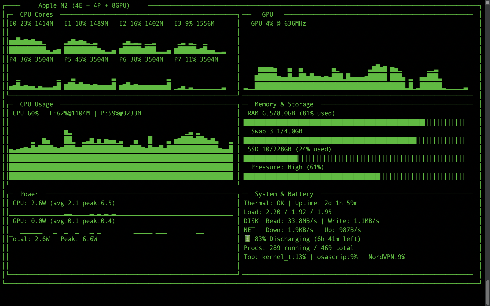

# vtop 🖥️

**Advanced System Monitor for macOS**

A beautiful, real-time system monitoring tool for macOS. Supports both **Apple Silicon** (M1/M2/M3/M4) and **Intel** CPUs. Monitor every CPU core, GPU, memory, storage, and more—all from your terminal.


## ✨ Features

### Architecture Support
- **Apple Silicon** (M1, M2, M3, M4): Full support with powermetrics for detailed per-core monitoring
- **Intel CPUs**: Per-core usage and frequency monitoring using psutil
- Automatic architecture detection

### CPU Monitoring
- **Per-core history charts** for all cores
- **Apple Silicon**: Separate E-cores (Efficiency) and P-cores (Performance) display
- **Intel**: Unified core display
- Real-time frequency tracking for each core
- Total CPU usage with cluster breakdown

### GPU Monitoring
- GPU utilization percentage and frequency
- Historical usage chart
 (Apple Silicon only)
- CPU power draw with avg/peak tracking
- GPU power draw with avg/peak tracking
- Total system power consumption
- Thermal throttling status

**Note**: Detailed power metrics require `sudo` and are only available on Apple Silicon via powermetrics.al available space like Finder)
- **Memory Pressure** indicator (Normal/Moderate/High)

### Power Consumption
- CPU power draw with avg/peak tracking
- GPU power draw with avg/peak tracking
- Total system power consumption
- Thermal throttling status

### System Information
- Thermal status
- System uptime
- Load average (1/5/15 min)
- Disk I/O (read/write speeds)
- Network I/O (download/upload speeds)
- Battery status (percentage, charging state, time remaining)
- Top CPU-consuming processes

## 📸 Screenshot



## 🚀 Installation

### From PyPI (recommended)
```bash
pip install vtop
```

### From GitHub
```bash
pip install git+https://github.com/filippovicidomini/vtop.git
```

### From source
```bash
git clone https://github.com/filippovicidomini/vtop.git
cd vtop
pip install .
```

### Development install
```bash
git clone https://github.com/filippovicidomini/vtop.git
cd vtop
pip install -e .
```

## 📖 Usage

**Apple Silicon Macs**: vtop requires `sudo` to access detailed power metrics via powermetrics:

```bash
sudo vtop
```

**Intel Macs**: vtop can run without `sudo` (limited power metrics):

```bash
vtop
# Or with sudo for any additional system access:
sudo vtop
```

### Options

| Option | Default | Description |
|--------|---------|-------------|
| `--interval` | 1 | Refresh interval in seconds |
| `--color` | 2 | Color theme (0-8) |
| `--avg` | 30 | Window for averaged values (seconds) |

### Examples

```bash
# Default usage
sudo vtop

# Update every 2 seconds
sudo vtop --interval 2

# Use a different color theme
sudo vtop --color 5
```

Press `Ctrl+C` to exit.

## 🔧 Requirements

- **macOS** 
  - Apple Silicon (M1, M2, M3, M4 series) - Full feature support
  - Intel x86_64 CPUs - Core monitoring support (limited power metrics)
- **Python 3.8+**
- Terminal with Unicode support

### Dependencies
- `dashing` - Terminal UI library
- `psutil` - System monitoring library

## 🏗️ Architecture

vtop uses a **provider pattern** to support multiple CPU architectures:

```
vtop/
├── vtop.py           # Main application and UI layout
├── parsers.py        # Parsing powermetrics output (Apple Silicon)
├── utils.py          # Utility functions and data gathering
├── providers/
│   ├── __init__.py   # Provider factory and exports
│   ├── base.py       # Abstract SystemProvider interface
│   ├── factory.py    # Architecture detection
│   ├── apple_silicon.py  # Apple M-series implementation
│   └── intel.py      # Intel x86_64 implementation
└── __init__.py
```

### Adding New Architectures

To add support for a new architecture (e.g., ARM Linux):

1. Create a new provider class inheriting from `SystemProvider` in `vtop/providers/`
2. Implement all abstract methods:
   - `get_soc_info()` - CPU information
   - `supports_powermetrics()` - Feature availability
   - `start_monitoring()` - Initialize monitoring
   - `get_metrics()` - Collect CPU/GPU/thermal data
   - `cleanup()` - Resource cleanup
3. Update `factory.py` to detect and return your provider
4. Test thoroughly on the target platform

## 🤝 Contributing

Contributions are welcome! Feel free to:

1. Fork the repository
2. Create a feature branch (`git checkout -b feature/amazing-feature`)
3. Commit your changes (`git commit -m 'Add amazing feature'`)
4. Push to the branch (`git push origin feature/amazing-feature`)
5. Open a Pull Request

## 📝 License

This project is licensed under the MIT License - see the [LICENSE](LICENSE) file for details.

## 🙏 Acknowledgments

- Inspired by [asitop](https://github.com/tlkh/asitop) by tlkh
- Built with [dashing](https://github.com/FedericoCeratto/dashing) terminal UI library

## 📊 Comparison with other tools

| Feature | vtop | htop | asitop |
|---------|------|------|--------|
| Per-core history | ✅ | ❌ | ❌ |
| GPU monitoring | ✅ | ❌ | ✅ |
| Power consumption | ✅ | ❌ | ✅ |
| Memory pressure | ✅ | ❌ | ❌ |
| Battery status | ✅ | ❌ | ❌ |
| Top processes | ✅ | ✅ | ❌ |
| Disk I/O | ✅ | ❌ | ❌ |
| Network I/O | ✅ | ❌ | ❌ |
| Apple Silicon optimized | ✅ | ❌ | ✅ |

---

Made with ❤️ for Apple Silicon
